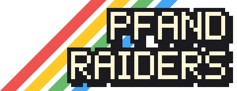

# PfandRaiders

Retro-Top-Down-Spiel: Pfandflaschen sammeln, abgeben, Container ausbauen. Design: `docs/superpowers/specs/`, Pläne: `docs/superpowers/plans/`.

## Entwickeln

    npm install
    npm run dev        # Spiel im Browser (Vite)
    npm test           # Tests aller Pakete
    npm run typecheck

## Spielen

Das Hauptmenü bietet Lokal spielen, Online spielen und Einstellungen (Effekte an/aus, Effekt-Lautstärke, Musik an/aus und Musik-Lautstärke; Lautstärken per Pfeiltasten, A/D oder Mausklick links/rechts der Zeile; Steuerung online, Auto-Wechsel, Steuerungsübersicht). Bedienung: Pfeile oder W/S wählen, Enter/E/Leertaste bestätigt, Esc geht zurück; Gamepad: Steuerkreuz, A, B. Lautstärken, die Schalter für Musik und Effekte und die Steuerung werden im Browser gespeichert.

Online spielt jeder Browser einen Spieler. Mit welchem Gerät, legt „Steuerung online“ in den Einstellungen fest (Tastatur 1, Tastatur 2, Gamepad 1 bis 4; Standard Tastatur 1; links/rechts oder Klick auf die Pfeile). Ist „Auto-Wechsel“ an (Standard), stellt ein Tastendruck auf einem Gamepad die Steuerung online sofort auf dieses Gamepad um und merkt sich das; die Tastenhinweise im HUD folgen dem Gerät. Online führt am Rundenende nur das B des gewählten Gamepads zurück ins Menü, beim Wiederverbinden nur Esc.

Musik: Im Hintergrund läuft ein im Browser erzeugter, fröhlicher Techno-Punk in Dur: abgedämpfte Punk-Gitarre in Achteln, treibender Bass, Techno-Beat mit durchgehender Kick, Offbeat-Hi-Hat, Snare auf 2 und 4 und Wirbeln am Phrasenende sowie eine eingängige Synth-Melodie. Im Lauf der Runde kommen Arpeggio, schnellere Hi-Hats und eine zweite Melodiestimme dazu, das Tempo steigt von 125 auf 165 BPM; im Menü spielt sie ohne Schlagzeug und Gitarre, nach Rundenende leiser. Ihre Lautstärke stellt man in den Einstellungen unter „Musik-Lautstärke“ ein (Standard 40 %). Musik und Soundeffekte lassen sich getrennt abschalten: in den Einstellungen mit „Musik: an/aus“ und „Effekte: an/aus“, im Spiel mit `M` (oder „Ton“ im Esc-Menü), das reihum weiterschaltet: beides an → Musik aus → Effekte aus (Musik wieder an) → beides aus → beides an. Der neue Zustand steht nach jedem Druck kurz als Hinweis im HUD (im Splitscreen in jeder Ansicht), z. B. „Musik aus, Effekte an“.

Lokal mit 1 bis 4 Spielern, jeder mit eigener Kamera. Im lokalen Spiel (Menüpunkt "Lokal spielen") treten Spieler in der Lobby mit der Aktionstaste ihres Geräts bei, Start mit Leertaste oder Start-Taste des Gamepads, Zurück ins Menü mit Esc oder Gamepad B.

| Gerät | Laufen | Aktion | Ausrauben | Schlagen | Pfefferspray |
|---|---|---|---|---|---|
| Tastatur 1 | WASD | E | Q | F | C |
| Tastatur 2 | Pfeile | Enter | / | . | , |
| Gamepad | Stick oder Steuerkreuz | A | B | X | Y |

In der lokalen Lobby stellt links/rechts (A/D, Pfeile, Stick oder Steuerkreuz) die Rundenzeit ein: 3, 5, 7 oder 10 Minuten, Standard 5; die Wahl wird im Browser gemerkt.

Jede Runde (lokal und online, auch jede weitere nach der Shop-Phase) beginnt mit einem Countdown von 5 Sekunden: Groß in der Bildmitte erscheinen 5, 4, 3, 2, 1 (je ein kurzer Ton) und dann für einen Moment „LOS!“ mit einem höheren Ton; im Splitscreen steht der Countdown in jeder Ansicht. Solange er läuft, steht alles still: Niemand kann laufen, suchen, abgeben oder schlagen, die Rundenzeit läuft noch nicht, NPCs, Zonen, Hunger und das Nachfüllen der Spots ruhen, und Hinweise im HUD gibt es noch keine. Eine beim Countdown schon gehaltene Taste wirkt ab „LOS!“. Die Spielmusik setzt mit „LOS!“ ein, vorher läuft die bisherige Musik weiter. Das Esc-Menü geht auch im Countdown; lokal hält es auch den Countdown an. Online kann man während des Countdowns wie während der Runde nicht neu beitreten; wer in der Rückkehrfrist zurückkommt, sieht den restlichen Countdown.

Aktion: Suchen (im Stand drücken und 1,5 s halten), Pfand abgeben (am Pfandautomaten drücken und halten). Die Abgabe dauert: Die erste Flasche geht sofort beim Drücken in den Automaten, danach alle 0,15 s eine weitere, die wertvollste zuerst (Kasten, Glas, Plastik); jede wird sofort gutgeschrieben und mit einem „Pling“ quittiert, dessen Ton bei schneller Folge ansteigt. Ein voller Container (31 Flaschen) braucht so 4,5 s, mit Kundenkarte (alle 0,1 s) 3 s. Loslassen, Weglaufen oder ein leerer Container beenden die Abgabe; nach dem Weglaufen mit gehaltener Taste muss man neu drücken. Wer mit Flaschen am Automaten drückt, gibt ab und sucht nicht gleichzeitig an einem nahen Spot. Eine Suche beginnt nur mit einem neuen Tastendruck: Wer beim Laufen die Taste festhält, sucht beim Stehenbleiben nicht automatisch, und nach dem Weglaufen oder einer fertigen Suche muss man die Taste erst loslassen und neu drücken. Beim Suchen findet man manchmal etwas zu essen (Mülleimer 10 %, sonst 4 %): Es heilt sofort 30 Leben, ein kurzer Hinweis nennt den Fund (z. B. „Kalte Pizza unterm Busch gefunden. Lecker!“; bei vollem Leben mit „Aber du bist schon satt.“). Leere Spots füllen sich nach 30 s wieder (in einer Event-Zone nach 8 s). Am Rundenende zeigt ein Ergebnisfeld die Rangliste mit Runden- und Gesamtverdienst; nach kurzer Sperre führen `R` oder die Aktionstaste in die Shop-Phase, `Esc` (lokal auch Gamepad B, online das B des gewählten Gamepads) zurück ins Menü. Zwei Spieler an einer Tastatur sind durch Keyboard-Ghosting begrenzt (nicht alle Tastenkombinationen werden erkannt).

Während der Runde öffnet `Esc` (Gamepad: Start) ein kleines Menü mit „Fortsetzen“, „Ton“ (zeigt „an“, „aus“, „Musik aus“ oder „Effekte aus“ und schaltet wie `M` weiter) und „Spiel verlassen“ (mit Rückfrage). Bedienung wie im Hauptmenü, Maus geht auch; `Esc` oder Gamepad B schließt es. Lokal hält das Menü das Spiel samt Rundenzeit an, online läuft die Runde weiter und die eigene Figur steht still.

## Serie, Shop-Phase und Kampf

Ein Raum (online) bzw. eine lokale Runde spielt eine Serie: Lobby, Runde, Rangliste, Shop-Phase, nächste Runde. Online legt der Host in der Lobby die Rundenzahl fest (1, 3 oder 5 Runden oder „offen“, Standard 3). Nach der letzten Runde (oder wenn der Host im Shop „Serie beenden“ wählt) folgt statt des Shops die Endwertung nach Gesamtverdienst mit dem Gesamtsieger; der Host holt mit „Zur Lobby“ alle zurück in dieselbe Lobby (Code, Name, Passwort, Figuren, Einstellungen und Chat bleiben, Geld und Käufe beginnen neu), die anderen sehen „Warte auf den Host…“. Lokal endet die Serie mit Esc. Geld und Gekauftes bleiben über die Runden (außer dem Einkaufswagen, der nur für eine Runde gemietet ist); Position, Flaschen, Leben, Schutz, Abklingzeiten, Spots, NPCs, Zonen und Zeit beginnen jede Runde neu. Gewertet wird der Rundenverdienst (Pfand dieser Runde) und der Gesamtverdienst der Serie (Summe aller Rundenverdienste; Ausgaben im Shop mindern ihn nicht). Wer sich online trennt, behält seinen Stand bis zum Ende der Rückkehrfrist und steht in der nächsten Runde als Figur still; wer den Raum verlässt, verliert ihn.

Die Rundenzeit wählt der Host in der Lobby: 3, 5, 7 oder 10 Minuten, Standard 5.

In der Shop-Phase kaufen alle gleichzeitig. Bedient wird nur mit den Bewegungstasten des eigenen Geräts und der Aktionstaste: hoch/runter wählt den Eintrag, links/rechts wechselt die Kategorie (auf Pfefferspray und Leckerli: die Menge), die Aktionstaste kauft bzw. drückt „Bereit“. Lokal hat jeder Spieler ein eigenes Feld. Online geht zusätzlich die Maus (Kategorie, Eintrag, −/+, Kaufen, Bereit). Die nächste Runde beginnt erst, wenn alle verbundenen Spieler bereit sind; „Bereit“ lässt sich zurücknehmen, solange nicht alle bereit sind. Ein Zeitlimit gibt es nicht.

| Kategorie | Eintrag | Preis | Wirkung |
|---|---|---|---|
| Taschen | Tasche | 1,50 € je Stück, bis 4 | +2 Plätze |
| Taschen | Rucksack | 4,00 € je Stück, bis 2 | +5 Plätze |
| Taschen | Einkaufswagen | 1,00 € Miete | +10 Plätze, 30 % langsamer, nur für die nächste Runde |
| Upgrades | Taschenlampe | 2, 5, 10 € | Suchzeit −15, −30, −45 % |
| Upgrades | Kundenkarte | 3 € | Pfandautomat: alle 0,1 s statt 0,15 s eine Flasche |
| Upgrades | Kundenkarte+ | 6 € (braucht Kundenkarte) | +10 % Pfand je Flasche (8 → 9, 15 → 17, 25 → 28 ct) |
| Waffen | Boxhandschuh | 4 € | Schlag 30 statt 20 Schaden |
| Verteidigung | Pfefferspray | 3 € je Flasche (10 Ladungen), bis 99 Ladungen | eigene Taste, siehe Kampf |
| Verteidigung | Ausweisdokumente | 3 € | Polizei kontrolliert dich nicht, nur für die nächste Runde |
| Verteidigung | Leckerli | 1 € je Stück | lenkt einen Hund ab, automatisch |

Mit leeren Händen trägt man 3 Flaschen, voll ausgestattet 31 (ohne Wagen 21). Tasche und Rucksack kauft man je Kauf einzeln bis zur Grenze, Pfefferspray und Leckerli in Mengen; reicht das Geld nicht für die ganze Menge, wird nichts gekauft. Die Preise sind Startwerte.

Kampf: Die Schlagen-Taste trifft den nächsten wachen Mitspieler in 20 px Reichweite mit 20 Schaden (mit Boxhandschuh 30); danach 0,6 s Pause. Wer gerade Schutz hat, nimmt keinen Schaden. Pfefferspray (eigene Taste, mit Ladungen aus dem Shop): trifft den nächsten wachen Mitspieler in 30 px, stößt ihn 40 px weg (Wände halten ihn auf) und nimmt ihm 2 Leben; danach 1 s Pause. Eine Ladung wird nur verbraucht, wenn jemand in Reichweite ist. Wer Schutz hat, wird weder gestoßen noch verletzt (die Ladung ist trotzdem weg). Alle sehen eine kurze orange Wolke, Sprühender und Getroffener hören ein Zischen. Bei 0 Leben ist man ausgeknockt (10 s): Solange steht groß in der Mitte des eigenen Bilds (im Splitscreen nur in der Ansicht des Ausgeknockten, online nur in der eigenen) „AUSGEKNOCKT“ mit den aufgerundeten Restsekunden darunter, nach einem Raub zusätzlich „Ausgeraubt!“. Danach steht man an derselben Stelle mit 60 Leben und 3 s Schutz wieder auf. Geld, Flaschen und Gekauftes bleiben dabei erhalten. Wache Mitspieler kann man nicht bestehlen. Einen Ausgeknockten kann man einmal pro Knockout mit der Ausrauben-Taste ausrauben: Ein Druck im Stand neben ihm nimmt ihm sofort die Hälfte seiner Flaschen (aufgerundet, die wertvollsten zuerst, so viel in den eigenen Container passt); sein Schutz zählt dabei nicht, eine Abklingzeit gibt es nicht. Der Hinweis „Ausrauben“ erscheint nur, wenn ein Ausgeknockter in Reichweite ist. Ist der eigene Container voll, passiert nichts: Der Ausgeknockte bleibt ausraubbar. Hunde und Polizisten lassen Ausgeknockte in Ruhe.

## Leben und Events

Leben sinken durch Hunger (1 pro 8 s), Hundebisse (15) und Schläge; bei 0 Leben ist man ausgeknockt (siehe oben). Essen, das man beim Suchen findet, heilt 30. Lebensbalken: Oben rechts im eigenen HUD steht immer ein Balken mit der Zahl (z. B. „73/100“). Darunter zeigt das eigene HUD den Container als Reihe von Flaschensymbolen: Plastik blau, Glas grün, Kasten braun, freie Plätze grau (16 je Zeile). Unter der Zeile mit dem Leben stehen kurz Leckerli, Spray-Ladungen, Wagen, Kundenkarte und Ausweis. Über jeder Figur erscheint ein kleiner Balken, sobald sie nicht mehr volle Leben hat (gerechnet wie die Zahl im HUD, also aufgerundet): grün über 60 %, gelb über 30 %, darunter rot; Ausgeknockte zeigen einen leeren Balken. So sieht man auch bei Mitspielern, wie viel ein Schlag angerichtet hat. Hunde und Polizisten kommen durch die Eingänge der Karte und verschwinden nie wieder: wer gerade niemanden jagt, streunt gemächlich durch die Stadt (kurze Wege, dazwischen Pausen) und jagt wieder los, sobald ein passender Spieler in die Nähe kommt (Hund 160 px, Polizist 140 px). Verliert ein Hund oder Polizist sein Ziel (der Spieler ist weiter weg als diese Reichweite oder kommt nicht mehr in Frage, etwa weil er ausgeknockt ist), bleibt er 8 s stehen, der Hund sitzt dabei und schaut sich um. Er läuft dem Spieler dann nicht hinterher und jagt in dieser Zeit nur wieder los, wenn ein passender Spieler auf 60 px herankommt; danach streunt er wie gewohnt. Neue kommen nur dazu, solange weniger als 3 jagen, insgesamt sind es höchstens 6. Pro Spieler jagt höchstens ein Hund: Solange ein Hund einen Spieler verfolgt (auch während ihn ein Leckerli ablenkt), lassen alle anderen Hunde diesen Spieler in Ruhe; erst wenn er sich setzt, aufgibt oder sein Ziel verliert, darf ein anderer Hund übernehmen. Für Polizisten gilt diese Grenze nicht. Hunde beißen einmal zu, setzen sich danach 8 s hin (beißen dabei niemanden) und streunen dann weiter; mit einem Leckerli aus dem Vorrat (wird automatisch eingesetzt, eines pro Hund) lassen sie sich ablenken. Polizisten konfiszieren nach 2 s Kontrolle die Hälfte der Flaschen und streunen danach weiter, wer wegläuft, entgeht der Kontrolle; eine Beschlagnahme meldet ein eigener Ton und für 3 s der Hinweis „N Flaschen beschlagnahmt!“. Wer Ausweisdokumente hat, wird in dieser Runde von Polizisten in Ruhe gelassen. Hunde und Polizisten laufen um Häuser herum: Ist der direkte Weg verbaut, suchen sie per Breitensuche auf dem Kachelraster (Wände und weiche Hindernisse gelten als gesperrt) höchstens alle 300 ms einen Weg; beim Streunen wählen sie nur Ziele, die sie geradeaus erreichen. Wer gebissen oder kontrolliert wurde, hat vor diesem Hund bzw. Polizisten 20 s Ruhe. Ohne Biss oder Kontrolle geben sie nach ihrer Zeit (Hund 30 s, Polizist 20 s) auf, lassen den Verfolgten ebenfalls 20 s in Ruhe und streunen (Hunde setzen sich vorher noch). Stadion und Konzert laden regelmäßig zu Events ein: 20 s vorher gibt es einen Hinweis, dann liegt dort 60 s lang dreifach so viel Pfand und Spots füllen sich schneller nach.

## Karten

Es gibt zwei Karten. `city` ist die Standardkarte, eine Stadt mit 64 x 40 Kacheln (Straßen, Häuser, Parks, zwei Pfandautomaten, acht Startpunkte, Zonen Stadion und Konzert). `retro` ist die kleine Ursprungskarte mit 32 x 20 Kacheln und den selbst gezeichneten Kacheln. Jede Karte hat eine Kennung, die der Server in der Start-Nachricht mitschickt; der Client wählt danach die Grafik.

- Lokal: `?map=retro` oder `?map=city` in der URL.
- Server: Umgebungsvariable `MAP_ID` (`city` oder `retro`, Standard `city`).
- Eine Kartenauswahl in Menü und Raum gibt es noch nicht.

Die Stadt wird aus einem ASCII-Plan erzeugt: `packages/core/src/maps/cityPlan.ts` (Legende im Kopf der Datei) wird mit `npx tsx packages/core/scripts/generateCity.ts` zur Tiled-Datei `city.tiled.json` mit Regel- und Grafikebenen. Nach Änderungen am Plan die Datei neu erzeugen; ein Test prüft, dass beide übereinstimmen und dass jeder Punkt von jedem Startpunkt aus erreichbar ist. Die Retro-Karte entsteht ebenso aus `packages/core/src/maps/retro-ascii.ts` mit `npx tsx packages/core/scripts/asciiToTiled.ts`. Shops gibt es auf keiner Karte mehr; das frühere Zeichen `S` bzw. der Objekttyp `shop` sind ungültig.

Bäume und Laternen sind weiche Hindernisse (Ebene `soft`): sie blockieren nur einen kleinen Kern in der Kachelmitte, man läuft also dicht daneben vorbei. Außerdem rutscht der Spieler an Ecken, die ihn nur wenige Pixel überlappen (bis `CONFIG.slideMaxPx`), automatisch um die Kante herum, statt hängen zu bleiben.

## Grafik

Die Spielwelt (Boden, Dächer, Fassaden, Spots, Pfandautomat) nutzt die freien Kacheln "Roguelike Modern City" von [Kenney](https://kenney.nl) (CC0, Lizenzdatei unter `packages/client/src/assets/kenney/`). Welche Zelle des Kachelbogens für welches Bild genutzt wird, steht als reine Tabelle in `packages/client/src/kenneyMap.ts`. Fehlt der Bogen, fällt das Spiel auf die selbst gezeichneten Muster zurück.

Die Spielerfiguren stammen aus dem [Tiny Characters Set](https://opengameart.org/content/tiny-characters-set) von Fleurman (CC0), das auf den [RPG character sprites](https://opengameart.org/content/rpg-character-sprites) von GrafxKid (CC0) beruht (Dateien und `CREDITS.txt` unter `packages/client/src/assets/characters/`). Jeder Spieler bekommt nach seiner Position eine von acht festen Figuren (`packages/client/src/playerChars.ts`) und einen Ring in seiner Spielerfarbe unter den Füßen. Fehlt ein Figurenbogen, zeichnet das Spiel für diesen Spieler die selbst gezeichnete Figur.

Hunde und Polizisten stammen aus den [Dog Spritesheets](https://opengameart.org/content/dog-spritesheets) von Jason of GDN (CC0, drei Fellfarben) und dem [Officer Character](https://opengameart.org/content/officer-character) von Chasersgaming (CC0); Dateien und `CREDITS.txt` liegen unter `packages/client/src/assets/npc/`, welche Zeile des Bogens wann läuft, steht in `packages/client/src/npcAnim.ts`. Fehlt ein Bogen, nutzt das Spiel den selbst gezeichneten Hund bzw. Polizisten (`packages/client/src/sprites/`).

### Credits

Dieselbe Liste zeigt das Spiel im Hauptmenü unter "Credits" (Daten in `packages/client/src/credits.ts`, Enter öffnet den Link):

- [Roguelike Modern City](https://kenney.nl/assets/roguelike-modern-city) – Kenney, CC0 (Kacheln der Spielwelt)
- [Tiny Characters Set](https://opengameart.org/content/tiny-characters-set) – Fleurman, CC0 (Spielerfiguren)
- [RPG character sprites](https://opengameart.org/content/rpg-character-sprites) – GrafxKid, CC0 (Grundlage des Tiny Characters Set)
- [Dog Spritesheets](https://opengameart.org/content/dog-spritesheets) – Jason of GDN, CC0 (Hunde)
- [Officer Character](https://opengameart.org/content/officer-character) – Chasersgaming, CC0 (Polizist)
- [Phaser 3](https://phaser.io) – Photon Storm, MIT (Spiel-Framework)
- [PfandRaiders](https://github.com/dasistdaniel/pfandraiders) – dasistdaniel (Sound, Musik und Karten selbst erzeugt)

## Testhilfen per URL

`?solo=1` (ein Spieler, ohne Lobby), `?players=2` (n Spieler ohne Lobby, abwechselnd Tastatur 1 und 2), `?round=30` (Rundenlänge in Sekunden, überschreibt die Wahl der Lobby), `?seed=123` (feste Zufallsbefüllung), `?events=now` (NPCs und Zonen sofort statt nach Minuten).

## Online spielen und Server

Der Mehrspieler-Server (`packages/server`) ist ein WebSocket-Server mit Räumen. Die Spiellogik liegt im Paket `core`. Der Server rechnet 20 Schritte pro Sekunde; die eigene Figur bewegt der Client trotzdem sofort mit derselben Laufregel vorher (Vorhersage), Abweichungen zum Server werden sanft korrigiert, große (Respawn, Neustart) sofort übernommen. Fremde Figuren werden mit 100 ms Verzögerung zwischen zwei Server-Ständen gezeigt.

Lokal starten (zwei Terminals):

    npm run dev:server   # Server auf ws://localhost:8080
    npm run dev          # Client; Server-Adresse per URL: ?server=ws://localhost:8080

Umgebungsvariablen des Servers:

- `PORT`: Listen-Port, Standard 8080.
- `ALLOWED_ORIGINS`: kommagetrennte Liste erlaubter Origins, zum Beispiel `https://dasistdaniel.github.io`. Ist sie leer, darf jede Origin verbinden (nur für die Entwicklung, der Server warnt beim Start).

- `ROUND_MS`: optionale feste Rundenlänge in Millisekunden für Testrunden (mindestens 1000). Ist sie gesetzt, gilt sie statt der Wahl des Hosts; sonst wählt der Host 3, 5, 7 oder 10 Minuten (Standard 5).
- `GRACE_MS`: wie lange der Server den Platz eines getrennten Spielers hält, ganze Zahl in Millisekunden, 5000 bis 3600000, Standard 120000 (2 Minuten). Ungültige Werte ergeben eine Warnung und den Standardwert. Ein leerer Raum bleibt mindestens so lange bestehen wie die Frist plus 15 s. Folge: Eine getrennte Figur steht bis zu 2 Minuten regungslos in der Runde und kann in dieser Zeit niedergeschlagen und ausgeraubt werden.
- Leere Werte (wie sie `docker-compose.yml` für nicht gesetzte `ROUND_MS`, `GRACE_MS` und `MAP_ID` weitergibt) gelten als nicht gesetzt: Standardwert, keine Warnung.

Im Hauptmenü öffnet "Online spielen" einen Dialog; oben steht der eigene Name (gilt für alle Tabs), darunter drei Tabs (Pfeiltasten wechseln, der gewählte Tab wird gemerkt): „Raum erstellen“ mit Raumname (Standard „<Name>s Raum“, bis 24 Zeichen), Sichtbarkeit (Öffentlich = in der Raumliste, Privat = nur per Code oder Link) und optionalem Passwort (bis 16 Zeichen); „Beitreten“ mit Raumcode und optionalem Passwort; „Raumliste“ mit allen öffentlichen Räumen (Raumname, Host, Spieler, Status; 🔒 = Passwort). In der Liste wählen Pfeil hoch/runter, Enter oder Klick tritt bei (bei 🔒 erst Passwort eingeben), R oder „Aktualisieren“ lädt neu; laufende oder volle Räume sind grau. Ein Passwort braucht man bei jedem Beitritt, nicht aber bei der Rückkehr nach einem Verbindungsabbruch; nach 5 falschen Versuchen pro Minute muss man kurz warten. In der Lobby stehen Raumname, Code und Schloss, die Spieler mit ihrer Figur und ein Raster mit allen 24 Figuren: Jede Figur gibt es pro Raum nur einmal, die eigene ist gelb umrandet, vergebene sind blass; Pfeiltasten oder Klick wählen, der Browser merkt sich die Wahl für das nächste Mal. Der Host stellt Rundenzeit und Rundenzahl ein. Die Server-Adresse kommt aus `?server=ws://…`, sonst aus der Build-Variable `VITE_SERVER_URL`, sonst `ws://localhost:8080`. In der Lobby kopiert „Link kopieren“ einen Teilen-Link in die Zwischenablage (`<Adresse des Clients>?join=CODE`, ein vorhandenes `?server=` bleibt erhalten; kurz erscheint „Kopiert!“). Klappt das Kopieren nicht (etwa ohne https, wenn auch der Ersatzweg scheitert), steht der Link zum Abschreiben neben dem Knopf. Wer den Link öffnet, landet direkt im Online-Dialog auf „Beitreten“ mit vorausgefülltem Raumcode und gibt nur noch seinen Namen ein; ein Passwort steht nie im Link; `?join=` verschwindet dabei aus der Adresszeile. Nach einem Verbindungsabbruch verbindet der Client automatisch neu: 30 s lang im 2-s-Takt, danach fragt er "Weiter versuchen?" (Enter = Ja, jede Runde wieder 30 s; Esc = Menü). Der Server hält den Platz 2 Minuten (siehe `GRACE_MS`); ist die Runde inzwischen vorbei, geht es direkt in die Shop-Phase bzw. zur Endwertung oder in die Lobby. Das Token liegt nur im sessionStorage, die Wiederverbindung klappt also beim Neuladen oder in einem duplizierten Tab, nicht in einem ganz neuen Tab. Wer online über „Spiel verlassen“ geht, gibt seinen Platz sofort frei (Nachricht `leave`): Das Token gilt danach nicht mehr, die Figur bleibt bis Rundenende als Statist stehen und ihr Verdienst zählt für die Rangliste; ihr Stand in der Serie verfällt.

**Chat in der Lobby:** In der Lobby gibt es unter der Spielerliste einen einfachen Textchat: Nachricht eintippen, Enter sendet. Eine Nachricht hat höchstens 140 Zeichen; der Server entfernt Steuer- und unsichtbare Formatzeichen, fasst Leerraum zusammen und kürzt Längeres. Gechattet werden kann nur, solange der Raum in der Lobby ist (während der Runde und in der Shop-Phase antwortet der Server mit `chat_closed`). Pro Spieler sind höchstens eine Nachricht pro Sekunde und fünf in zehn Sekunden erlaubt (sonst `chat_too_fast`, „Zu schnell.“). Wer später beitritt (auch per Token), bekommt die letzten 30 Nachrichten des Raums. Beitritte und Abgänge erscheinen als graue Zeilen. Gespeichert wird nichts: Der Verlauf liegt nur im Speicher des Raums und ist weg, sobald niemand mehr verbunden ist.

Weitere Grenzen im Server: Pro IP-Adresse sind höchstens 10 gleichzeitige Verbindungen erlaubt (Option `maxPerIp`), ein Socket ohne Raum wird nach 30 s geschlossen (`idleMs`). Als IP gilt der erste Eintrag des Headers `X-Forwarded-For`, sonst die Socket-Adresse. Der Header wird vertraut, weil nur der Reverse Proxy (Nginx Proxy Manager) den Server erreicht (der Container hat keinen Host-Port). Origins in `ALLOWED_ORIGINS` werden normalisiert (Kleinschreibung, ohne Schrägstrich am Ende).

Bauen: `npm run build:server` erzeugt `packages/server/dist/server.cjs` (eine einzelne Datei, läuft mit `node server.cjs` ohne `node_modules`).

Auf dem VPS (Docker, der Nginx Proxy Manager übernimmt HTTPS; das externe Docker-Netz `proxy-net` muss existieren):

    cd deploy
    echo "ALLOWED_ORIGINS=https://dasistdaniel.github.io" > .env   # einmalig; optional auch ROUND_MS, GRACE_MS, MAP_ID
    ./update.sh

`update.sh` holt den neuesten Stand (`git pull --ff-only`) und baut den Container mit Buildinfo neu. Von Hand geht es so:

    cd deploy
    GIT_SHA=$(git rev-parse --short=7 HEAD) BUILD_NUMBER=$(git rev-list --count HEAD) docker compose up -d --build

Buildinfo: Die Buildnummer des Servers ist die Anzahl der Commits (`git rev-list --count HEAD`), der Hash der Kurz-Hash des Commits. Beides steht in der Startmeldung des Servers und in der Online-Lobby ("Server: Build #… · …"). Die Nummer des Clients ist dagegen die Laufnummer von GitHub Actions; die Nummern unterscheiden sich also immer. Verglichen wird nur der Hash: Weicht er ab, warnt die Lobby, dass Client und Server verschiedene Versionen haben. Ohne `GIT_SHA` bleibt der Hash im Docker-Build leer (dort gibt es kein `.git`), dann entfällt die Warnung. `npm run build:server` liest Hash und Nummer aus `GIT_SHA` und `BUILD_NUMBER`, der Hash fällt sonst auf `git rev-parse` zurück, die Nummer auf `dev`.

Der Client für GitHub Pages wird mit der Repository-Variable `SERVER_URL` gebaut (zum Beispiel `wss://play.example.org`).

Handarbeit:

1. Im Nginx Proxy Manager einen Proxy Host anlegen: Domain `play.example.org`, Scheme `http`, Forward Hostname `pfandraiders-server`, Port `8080`, **Websockets Support** an. Im Tab SSL ein Let's-Encrypt-Zertifikat anfordern und `Force SSL` aktivieren.
2. DNS-Eintrag der Domain auf den VPS zeigen lassen.
3. In den Repository-Einstellungen unter Pages die Quelle auf "GitHub Actions" stellen und die Variable `SERVER_URL` setzen.

Grenzen (nicht für großen öffentlichen Betrieb gedacht):

- Das Limit pro IP-Adresse gilt nur pro Server-Prozess und hängt am Header `X-Forwarded-For`.
- Eine leere Lobby bleibt offen, solange ein Client verbunden ist.
- Das Raumcode-Raten ist nur pro Verbindung begrenzt, nicht global.
